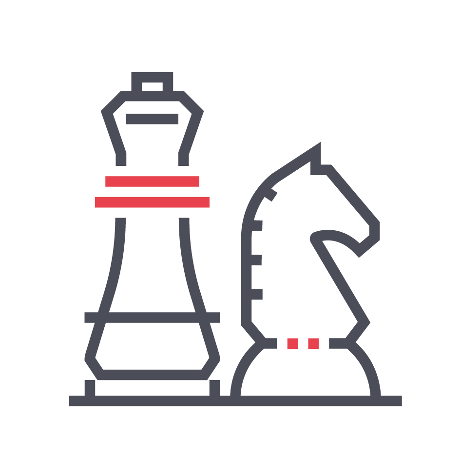
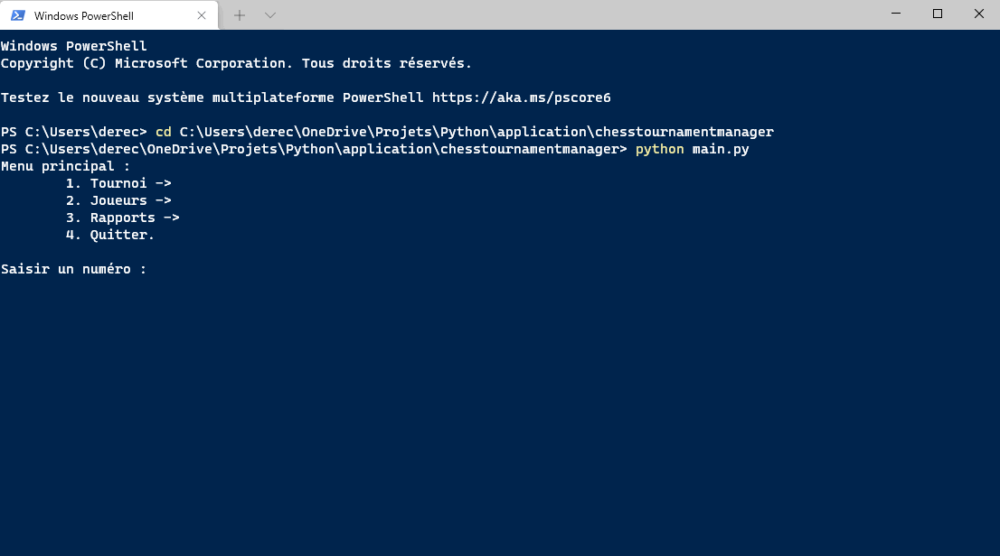
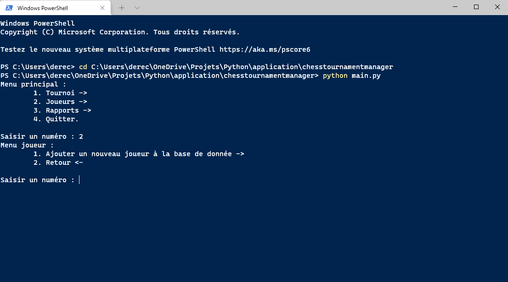
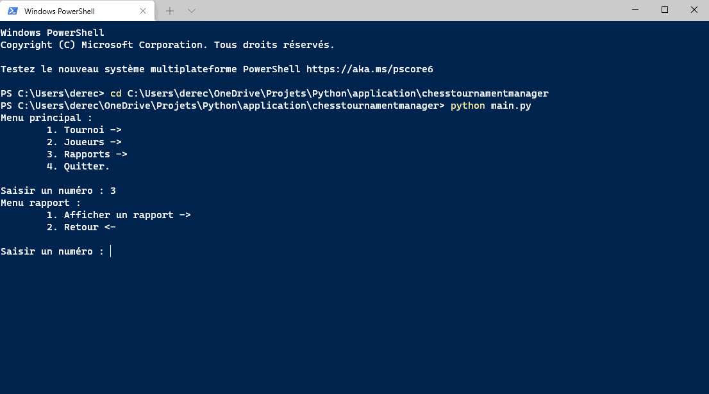

<div id="top"></div>


<!-- PROJECT LOGO -->
<div align="center">
  <a href="https://github.com/KDerec/chesstournamentmanager/blob/master/images/logo.png">
  </a>

<h3 align="center">Software program in Python</h3>
  <p align="center">
    This student project is the #3 of my training.<br>You can follow the previous <a href="https://github.com/KDerec/LearnHome">here</a> and next one <a href="https://github.com/KDerec/just-stream-it">here</a>.
  </p>
</div>


<details>
  <summary>Table of Contents</summary>
  <ol>
    <li><a href="#about-the-project">About The Project</a></li>
    <li><a href="#built-with">Built With</a></li>
    <li><a href="#installation">Installation</a></li>
    <li><a href="#generate-html-reports-of-flake8-violations">Flake8 report</a></li>
    <li><a href="#usage">Usage</a></li>
    <li><a href="#license">License</a></li>
    <li><a href="#contact">Contact</a></li>
  </ol>
</details>


## About The Project
### 🌱 Developed skills
- Become familiar with <b>classes</b> and <b>object-oriented programming</b>.
- Structure the code of a Python program using a <b>MVC (Model-View-Controller)</b> design pattern.
- Write robust Python code using <b>PEP 8</b> style guide.
- Work with a <b>database</b> of JSON type <b>(TinyDB)</b>.
### 🚀 Project goal
Develop an offline command-line application with local database to manage chess tournament event.  
The functionalities of the program are :
- Create <b>tournament</b> with :
  - Name ;
  - location ;
  - date ;
  - time controller (bullet, blitz and rapide) ;
  - and description.
- Create <b>players</b> with :
  - Last name ;
  - first name ;
  - birthday ;
  - sexe ;
  - and rank.
- <b>Play</b> tournament and :
  - Select a number of round ;
  - select a number of player ;
  - select players from the local database ;
  - <b>automatic player matchmaking</b> according to swiss system ;
  - put a score for every match ;
  - play every rounds and display the standings !
- <b>Display</b> reporting of :
  - All actors ;
  - all tournaments ;
  - all players of a tournament ;
  - all rounds of a tournament ;
  - all matchs of a tournament.

Tournaments and players are <b>all save</b> in a local database.

<p align="right">(<a href="#top">back to top</a>)</p>


### Built With

* [Python](https://www.python.org/)

<p align="right">(<a href="#top">back to top</a>)</p>


## Installation
1. <a href="#python-installation">Install Python</a> ;
2. Clone the project in desired directory ;
   ```sh
   git clone https://github.com/KDerec/chesstournamentmanager.git
   ```
3. Change directory to project folder ;
   ```sh
   cd path/to/chesstournamentmanager
   ```
4. Create a virtual environnement *(More detail to [Creating a virtual environment](https://packaging.python.org/en/latest/guides/installing-using-pip-and-virtual-environments/#creating-a-virtual-environment))* ;
    * For Windows :
      ```sh
      python -m venv env
      ```
    * For Linux :
      ```sh
      python3 -m venv env
      ```
5. Activate the virtual environment ;
    * For Windows :
      ```sh
      .\env\Scripts\activate
      ```
    * For Linux :
      ```sh
      source env/bin/activate
      ```
6. Install package of requirements.txt ;
   ```sh
   pip install -r requirements.txt
   ```
7. Run main.py and let yourself be guided by the application.


<p align="right">(<a href="#top">back to top</a>)</p>


### Python installation

1. Install Python. If you are using Linux or macOS, it should be available on your system already. If you are a Windows user, you can get an installer from the Python homepage and follow the instructions to install it:
   - Go to [python.org](https://www.python.org/)
   - Under the Download section, click the link for Python "3.xxx".
   - At the bottom of the page, click the Windows Installer link to download the installer file.
   - When it has downloaded, run it.
   - On the first installer page, make sure you check the "Add Python 3.xxx to PATH" checkbox.
   - Click Install, then click Close when the installation has finished.

2. Open your command prompt (Windows) / terminal (macOS/ Linux). To check if Python is installed, enter the following command (this should return a version number.):
   ``` sh
   python -V
   # If the above fails, try:
   python3 -V
   # Or, if the "py" command is available, try:
   py -V
   ```

<p align="right">(<a href="#top">back to top</a>)</p>


## Generate HTML reports of flake8 violations
1. Open a new terminal and change directory to project folder ;
   ```sh
   cd path/to/chesstournamentmanager
   ```
2. Run the below command ;
   ```sh
   flake8 --format=html --htmldir=flake-report
   ```
3. Change directory to flake-report folder ;
   ```sh
   cd ./flake-report
   ```
4. Open index.html.
   ```sh
   index.html
   ```
    * With Windows PowerShell :
      ```sh
      ./index.html
      ```
    * With Linux to display in the terminal :
      ```sh
      w3m -dump index.html
      ```

<p align="right">(<a href="#top">back to top</a>)</p>


<!-- USAGE EXAMPLES -->
## Usage
### Tournament creation and running example
Show the creation of a new tournament, playing of all rounds and the standing display:  
<a href="https://github.com/KDerec/chesstournamentmanager/blob/master/images/tournament_example.gif"></a>

### Player creation example
Show the complete creation of a new player:  
<a href="https://github.com/KDerec/chesstournamentmanager/blob/master/images/player_example.gif"></a>

### Report display example
Show the display of reportings, like "all the tournaments", "all rounds of a tournaments" or "all actors":  
<a href="https://github.com/KDerec/chesstournamentmanager/blob/master/images/report_example.gif"></a>

<p align="right">(<a href="#top">back to top</a>)</p>


<!-- LICENSE -->
## License

Distributed under the MIT License. See `LICENSE` for more information.

<p align="right">(<a href="#top">back to top</a>)</p>


<!-- CONTACT -->
## Contact

Kévin Dérécusson - kevin.derecusson@outlook.fr

Project Link: [https://github.com/KDerec/chesstournamentmanager](https://github.com/KDerec/chesstournamentmanager)

<p align="right">(<a href="#top">back to top</a>)</p>

<i>This student project is the #2 of my training.  
You can follow the previous <a href="https://github.com/KDerec/LearnHome">here</a> and next one <a href="https://github.com/KDerec/just-stream-it">here</a>.</i>
